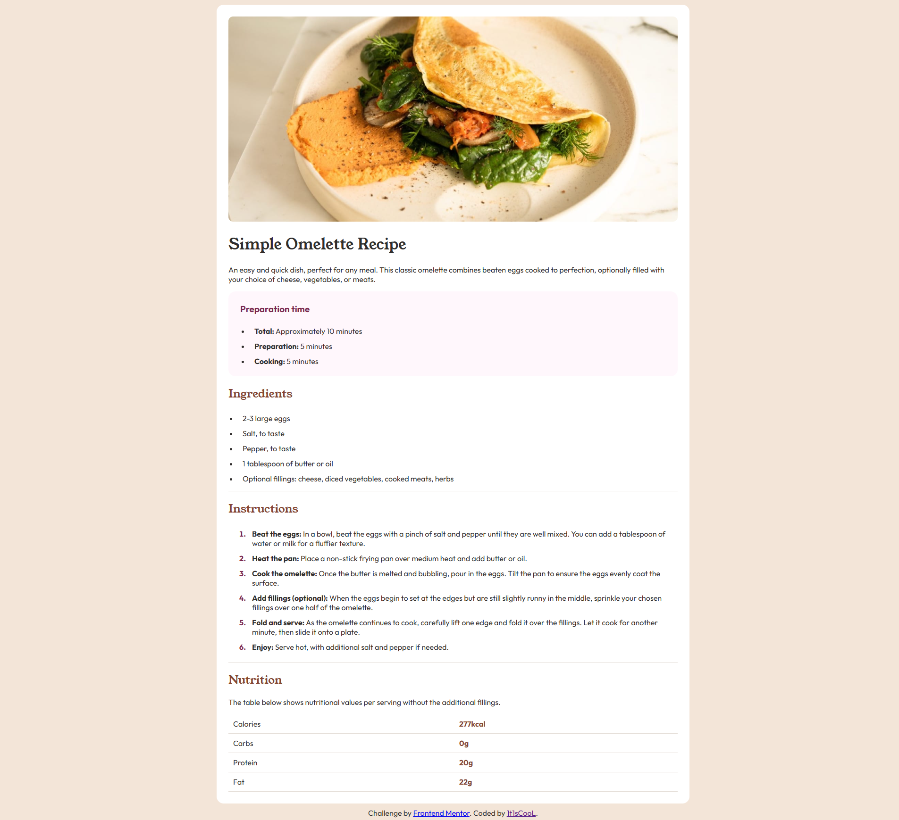

# Решение для Frontend Mentor - страница рецептов

Это решение проблемы [Страница рецептов в Frontend Mentor](https://www.frontendmentor.io/challenges/recipe-page-KiTsR8QQKm). Задачи Frontend Mentor помогут вам улучшить свои навыки программирования, создавая реалистичные проекты. 

### Скриншот

### Ссылки

- URL веб-сайта в реальном времени: (https://mmalabugin.ru/SimpleOmelleteRecipe)

## Мой процесс

### Создан с использованием

- Семантической разметки HTML5
- Пользовательских свойств CSS
- Рабочего процесса для мобильных устройств

### Чему я научился

Вспомнил немного как пиcать CSS и HTML, было полезно

## Автор

- Веб-сайт - [1t1sCooL](https://www.mmalabugin.ru/)
- Наставник по интерфейсу - [@1t1sCooL](https://www.frontendmentor.io/profile/1t1sCooL)
- Твиттер - [@vi_el_mar](https://www.twitter.com/vi_el_mar)
- Telegram - [@ItIsCooL](https://t.me/ItIsCooL)

